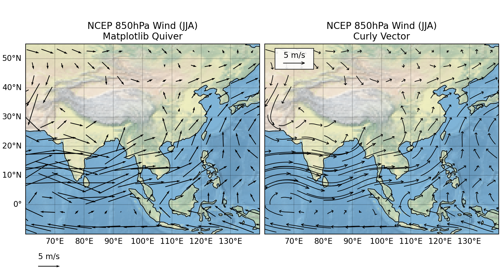
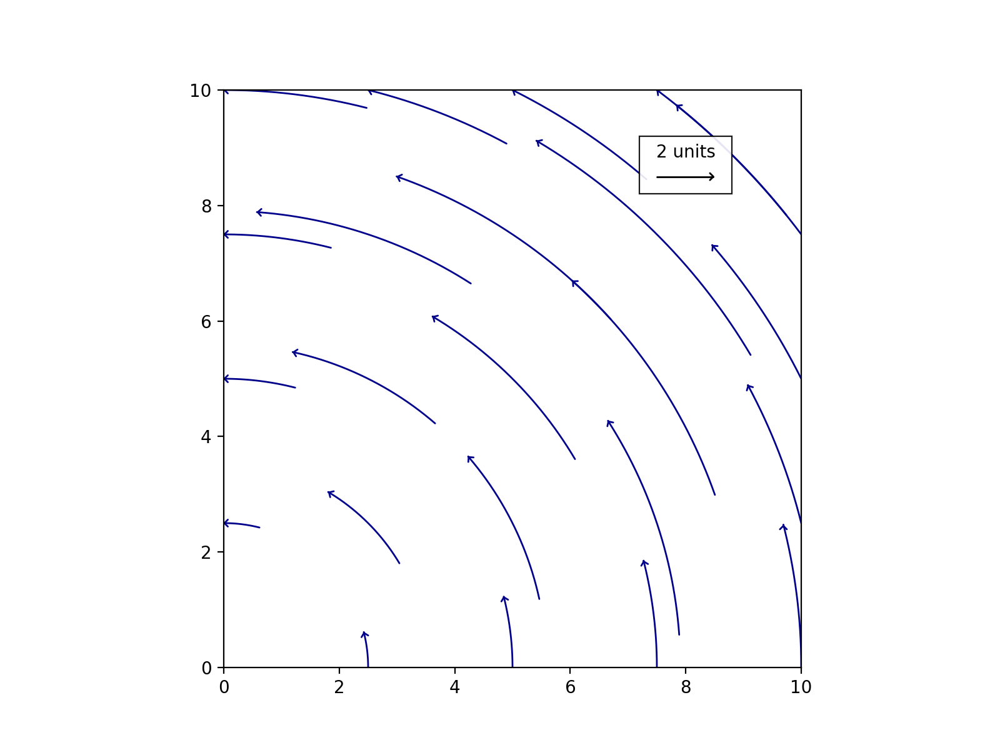
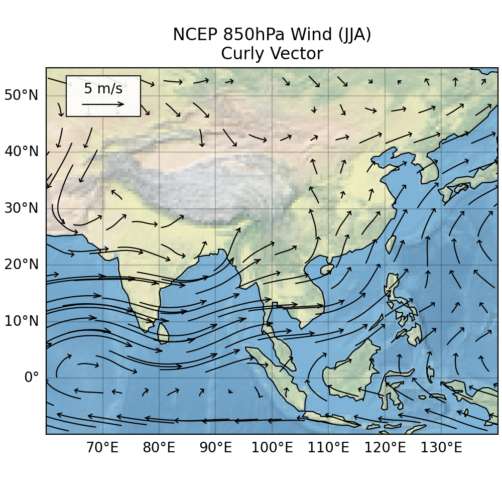

# CurlyVector

A Python library for creating curly vector field visualizations with matplotlib and Cartopy.

## Overview

CurlyVector creates curved arrows that follow vector field lines, with arrow lengths proportional to vector magnitude. Unlike traditional straight arrows, curly vectors provide a more intuitive visualization of flow fields by showing the actual path particles would follow. (comparing with defalt Matplotlib quiver)

It can only work with projection=ccrs.PlateCarree() now (for a correct vecotor key).



## Dependencies

### Required Dependencies
- **numpy** - Numerical computing and array operations
- **matplotlib** - Plotting and visualization
- **scipy** - Scientific computing (specifically `scipy.interpolate`)

### Optional Dependencies
- **cartopy** - Geographic projections and mapping (required for geographic data visualization)
- **xarray** - Labeled multi-dimensional arrays 
- **netcdf4** - for working with NetCDF data

### Installation

You can install the required dependencies using pip:

```bash
# Core dependencies
pip install numpy matplotlib scipy

# For geographic functionality
pip install cartopy

# For working with NetCDF data (used in examples)
pip install xarray netcdf4
```

Or install all dependencies at once:
```bash
pip install numpy matplotlib scipy cartopy xarray netcdf4
```

Or install via conda
```bash
conda install -c conda-forge numpy matplotlib scipy cartopy xarray netcdf4
```

---

## Basic Usage

```python
import numpy as np
import matplotlib.pyplot as plt
from curlyvector import curly_vector_plot, curly_vector_key

# Create sample data
x = np.linspace(0, 10, 5)
y = np.linspace(0, 10, 5)
X, Y = np.meshgrid(x, y)
U = -Y  # Circular flow
V = X

# Create plot
fig, ax = plt.subplots(figsize=(8, 6))
curly_vector_plot(ax, X, Y, U, V, scale=0.5, color='darkblue')
curly_vector_key(ax, X, Y, U, V, scale=0.5, key_length=2, label='2 units')
plt.show()
```





## Geographic Data with Cartopy

```Python
# see detail in ./doc/curly_vector.ipynb
# some code hidden
params = {'head_length': 0.5, 'head_width': 0.03, 'linewidth': 0.8, 'scale': 1.5, 'color': 'k'}

# Plot curly vectors
curly_vector_plot(ax1, lon_sub, lat_sub, u_sub, v_sub, 
                 transform=ccrs.PlateCarree(), 
                 **params)

# Add legend with proper parameters
curly_vector_key(ax1, lon_sub, lat_sub, u_sub, v_sub, 
                 key_length=5, label='5 m/s', 
                 loc=[0.08, 0.9], loc_coordinate='axes', 
                 fontsize=10, 
                 box=True, box_size=1.1, 
                 **params)
# some code hidden
```


## Contact

- **Author**: Yitao Liu
- **Email**: liuyitao97@outlook.com
- **Created**: June 2025

---

This is done with AI Copilot.

