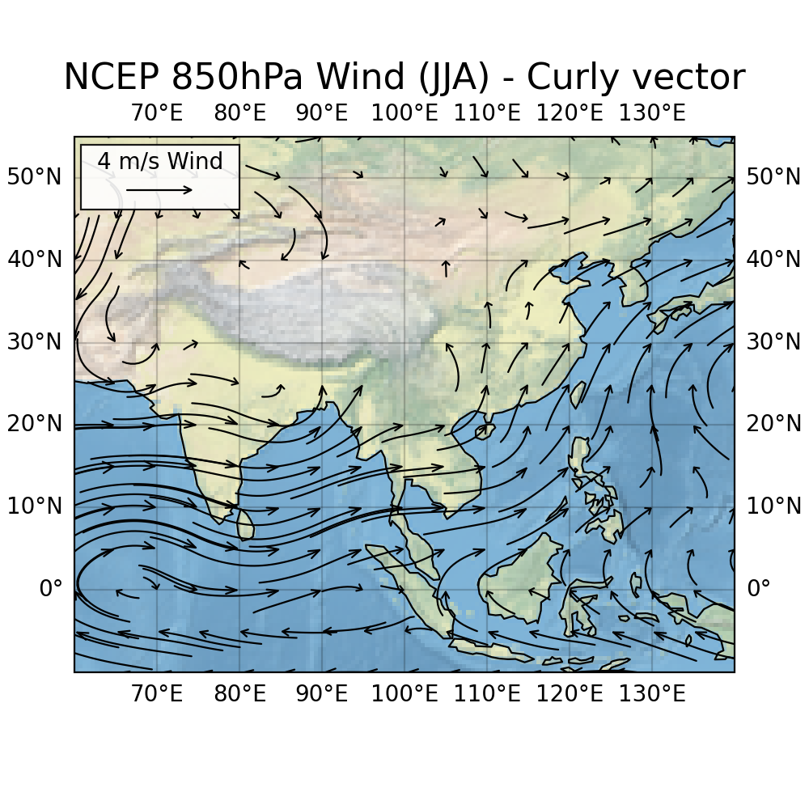

# CurlyVector

A Python library for creating beautiful curly vector field visualizations with matplotlib and Cartopy.

## Overview

CurlyVector creates curved arrows that follow vector field lines, with arrow lengths proportional to vector magnitude. Unlike traditional straight arrows, curly vectors provide a more intuitive visualization of flow fields by showing the actual path particles would follow.



### Basic Usage

```python
import numpy as np
import matplotlib.pyplot as plt
from curlyvector import curly_vector_plot, curly_vector_key

# Create sample data
x = np.linspace(0, 10, 20)
y = np.linspace(0, 10, 20)
X, Y = np.meshgrid(x, y)
U = -Y  # Circular flow
V = X

# Create plot
fig, ax = plt.subplots(figsize=(8, 6))
curly_vector_plot(ax, X, Y, U, V, scale=0.5, color='darkblue')
curly_vector_key(ax, X, Y, U, V, scale=0.5, key_length=2, label='2 units')
plt.show()
```

### Geographic Data with Cartopy

see the Jupyter notebook


## Contact

- **Author**: Yitao Liu
- **Email**: liuyitao97@outlook.com
- **Created**: June 2025

---

*CurlyVector - Making vector fields beautiful, one curve at a time* 
